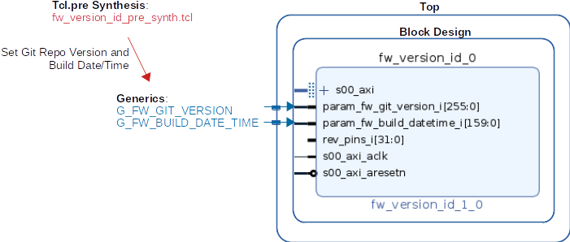

# General Information

## Maintainer
Jonas Purtschert [jonas.purtschert@psi.ch]

## Authors
Jonas Purtschert [jonas.purtschert@psi.ch]

## License
This library is published under [PSI HDL Library License](License.txt), which is [LGPL](LGPL2_1.txt) plus some additional exceptions to clarify the LGPL terms in the context of firmware development.

## Changelog
See [Changelog](Changelog.md)

## Dependencies

* TCL
  * [PsiSim](https://github.com/paulscherrerinstitute/PsiSim) (2.1.0 or higher, for development only)
  * [PsiIpPackage](https://git.psi.ch/GFA/Libraries/Firmware/TCL/PsiIpPackage) (1.6.0, for development only )
  * [PsiUtil](https://git.psi.ch/GFA/Libraries/Firmware/TCL/PsiUtil) (1.2.0, for development only )
* VHDL
  * [psi\_common](https://github.com/paulscherrerinstitute/psi_common) (2.5.0 or higher)

# Description
IP for storing build date/time and version based on git repository.
See following description of the Git Repo Version format: [HowTo: Git Repo Versioning](https://git.psi.ch/GFA/Documentation/HowToWorkWithGit/blob/master/HowTo.md#git-repository-versioning)

## AXI Address Map

| Offset     | Register       | R/W | Length   | Description                                |
| ------     | --------       | --- | ---      | -----------                                |
| 0x000      | Facility       | R   | 16 chars | Facility e.g. SwissFEL                     |
| 0x010      | Project        | R   | 16 chars | Project e.g. DBPM3-AthosBPM                |
| 0x020      | FW Version     | R   | 32 chars | FW Version in Git Describe format          |
| 0x040      | FW Buid Date   | R   | [31:0]   | Format: YYYY-MM-DD, encoded as: 0xYYYYMMDD |
| 0x044      | FW Buid Time   | R   | [15:0]   | Format: hh:mm, encoded as: 0x0000hhmm      |
| 0x048      | GPIO           | R   | [15:0]   | GPIO, eg. Hardware Rev pins, DIP switch    |
| 0x04C..7C  |                |     |          | reserved                                   |
| 0x080      | SW0 Version    | R/W | 32 chars | Git Describe based version                 |
| 0x0A0      | SW0 Build Date | R/W | [31:0]   | Format: YYY-MM-DD                          |
| 0x0A4      | SW0 Build Time | R/W | [15:0]   | Format: hh:mm                              |
| 0x0A8..AC  |                |     |          | reserved                                   |
| 0x0B0      | SW1 Version    | R/W | 32 chars | see SW0                                    |
| 0x0D0      | SW1 Build Date | R/W | [31:0]   | see SW0                                    |
| 0x0D4      | SW1 Build Time | R/W | [15:0]   | see SW0                                    |
| 0x0D8..DC  |                |     |          | reserved                                   |
| 0x0E0      | SW2 Version    | R/W | 32 chars | see SW0                                    |
| 0x100      | SW2 Build Date | R/W | [31:0]   | see SW0                                    |
| 0x104      | SW2 Build Time | R/W | [15:0]   | see SW0                                    |
| 0x108..10C |                |     |          | reserved                                   |

* Register: 0x000...07C
* BRAM: 0x080..10C

# Usage

* Add `fw_version_id` as a Git Submodule to your Project's library.

## FPGA

**Integration in Vivado:**  

To automatically integrate the Build Date/Time and Git Repo Version, a tcl script must be added to the Build process before synthesis:

1. Add Pre-Synthesis tcl script in: *Vivado > Project Settings > Synthesis > tcl.pre*
2. Select following script from library: `/fw_version_id/fw_version_id_pre_synth.tcl`

### Software

**Integration in SDK:**  

1. Copy Makefiles `/templates/makefile.defs/.targets` to SDK Project base.
2. Add Defined Symbol to SDK Project: `VERSION_GIT_REPO=\"$(VERSION_GIT_REPO)\"`:  *Properties > C/C++ Build > Symbols*
3. Adapt `makefile.targets`: Select object (e.g. main.o) which includes driver, to force compilation on a build run.
4. Call driver functions to write Git Repo Version and Build Date/Time into `fw_version_id` IP. (example: [main.c](templates/main.c)

**Explanation:**  
* The Makefiles are automatically included in the SDK managed Makefile process. 
* `Makefile.defs` defines Makro with Git Repo Version (Git Describe Call)
* `Makefile.targets` is used to force a rebuild of an object on every build. Otherwise the Version/Build Date might not be updated on every compile.
* Following Macros are available: `VERSION_GIT_REPO`, `SW_BUILD_DATE` and `SW_BUILD_TIME`.
* Using Driver functions `set_version_git()` and `set_version_build()` to write Version Info into BRAM of `fw_version_id` IP in FPGA. See Example [main.c](templates/main.c).

### Epics

* Example template: [version.template](templates/version.template)

**Output records to use in panels:**  

| Record                                     | Description           | Example          |
| ------                                     | ----                  | --------         |
| `$(DEV):$(SYS)-FW-FACILITY`                | FW Facility           | SwissFEL         |
| `$(DEV):$(SYS)-FW-PROJECT`                 | FW Project            | DBPM3-AthosBPM   |
| `$(DEV):$(SYS)-FW-VERSION`                 | FW Git Repo Version   | 0.3.2-13-gab3451 |
| `$(DEV):$(SYS)-FW-BUILD-DATETIME-S.SVAL`   | FW Build Date/Time    | 2021.02.17 13:40 |
| =====                                      | ====                  | ====             |
| `$(DEV):$(SYS)-RPU0-VERSION`               | SW0 Git Repo Version  | 0.3.2-13-gab3451 |
| `$(DEV):$(SYS)-RPU0-BUILD-DATETIME-S.SVAL` | SW0 Build Date/Time   | 2021.02.17 13:40 |
| =====                                      | ====                  | ====             |
| `$(DEV):$(SYS)-RPU1-VERSION`               | SW1 Git Repo Version  | 0.3.2-13-gab3451 |
| `$(DEV):$(SYS)-RPU1-BUILD-DATETIME-S.SVAL` | SW1 Build Date/Time   | 2021.02.17 13:40 |

