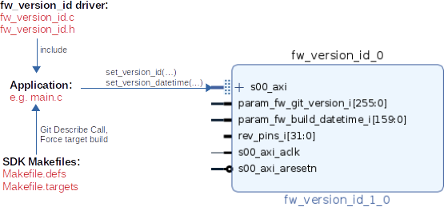

# General Information

Automatic generation of version number and build time for Software/Firmware, based on Git Repository status.
The version format based on `git describe`:  


Example Panel:  


## Maintainer
Jonas Purtschert [jonas.purtschert@psi.ch]

## Authors
Jonas Purtschert [jonas.purtschert@psi.ch]

## License
This library is published under [PSI HDL Library License](License.txt), which is [LGPL](LGPL2_1.txt) plus some additional exceptions to clarify the LGPL terms in the context of firmware development.

## Dependencies

* TCL
  * [PsiSim](https://github.com/paulscherrerinstitute/PsiSim) (2.1.0 or higher, for development only)
  * [PsiIpPackage](https://git.psi.ch/GFA/Libraries/Firmware/TCL/PsiIpPackage) (1.6.0, for development only )
  * [PsiUtil](https://git.psi.ch/GFA/Libraries/Firmware/TCL/PsiUtil) (1.2.0, for development only )
* VHDL
  * [psi\_common](https://github.com/paulscherrerinstitute/psi_common) (2.5.0 or higher)

# Description
* IP for storing build date/time and version based on git repository.
* Constains scripts and workflow to automate FW/SW Versioning.
* See following description of the Git Repo Version format: [HowTo: Git Repo Versioning](https://git.psi.ch/GFA/Documentation/HowToWorkWithGit/blob/master/HowTo.md#git-repository-versioning)

## AXI Address Map

* Byte address offset

| Offset | Register              | R/W | Length   | Description                         | Example                |
| ------ | --------              | --- | ---      | -----------                         | -------                |
| 0x000  | Facility              | R   | 16 chars | Facility                            | SwissFEL               |
| 0x010  | Project               | R   | 16 chars | Project                             | DBPM3-AthosBPM         |
| 0x020  | HW Revision           | R   | 4 chars  | HW Revision                         | B                      |
| 0x024  |                       |     |          | reserved                            |                        |
| 0x040  | ID0 Descriptor *)     | R   | 8 chars  | Descriptor of current version block | PL                     |
| 0x048  | ID0 Version *)        | R   | 32 chars | FW Version in *Git Describe* format | 0.1.0-13-g55ecb1-dirty |
| 0x068  | ID0 Buid Date/Time *) | R   | 20 chars | Format: YYYY-MM-DD HH:MM:SS         | 2021-11-03 10:41:41    |
| 0x07C  |                       |     |          | reserved                            |                        |
| 0x080  | ID1 Descriptor        | RW  | 8 chars  |                                     | RPU0                   |
| 0x088  | ID1 Version           | RW  | 32 chars |                                     | 1.2.0                  |
| 0x0A8  | ID1 Buid Date/Time    | RW  | 24 chars |                                     |                        |
| 0x0BC  |                       |     |          |                                     |                        |
| 0x0C0  | ID2 Descriptor        | RW  | 8 chars  |                                     | RPU1                   |
| 0x0C8  | ID2 Version           | RW  | 32 chars |                                     | 1.2.0-3-g45abc         |
| 0x0E8  | ID2 Buid Date/Time    | RW  | 24 chars |                                     |                        |
| 0x0FC  |                       |     |          |                                     |                        |
| 0x100  | ID3 Descriptor        | RW  | 8 chars  |                                     |                        |
| 0x108  | ID3 Version           | RW  | 32 chars |                                     |                        |
| 0x128  | ID3 Buid Date/Time    | RW  | 24 chars |                                     |                        |
| 0x13C  |                       |     |          |                                     |                        |
| 0x140  | ID4 Descriptor        | RW  | 8 chars  |                                     |                        |
| 0x148  | ID4 Version           | RW  | 32 chars |                                     |                        |
| 0x168  | ID4 Buid Date/Time    | RW  | 24 chars |                                     |                        |
| 0x17C  |                       |     |          |                                     |                        |

   *) Reserved for PL and automatically set by pre-tcl script in registers.

* Register: 0x000...07C
* BRAM: 0x080..17C


# Usage

* Add `fw_version_id` as a Git Submodule to your Project's library.

## FPGA

**Integration in Vivado:**  


1. Instantiate VivadoIP in Block Design and pass the signals **param_fw_git_version_i** and **param_fw_build_datetime_i** to the top level vhdl file.
2. connect the two signal to the toplevel generics:

 ```
 entity top is
  generic (
    G_FW_GIT_VERSION      : std_logic_vector(255 downto 0) := (others=>'1');
    G_FW_BUILD_DATE_TIME  : std_logic_vector(159 downto 0) := (others=>'1')
 );
 ```

To automatically set the Version and Build-Date generics on every build, a tcl script must be added to the Build process before synthesis:

1. Add Pre-Synthesis tcl script in: *Vivado > Project Settings > Synthesis > tcl.pre*
2. Select following script from library: `/fw_version_id/fw_version_id_pre_synth.tcl`

## Software

**Integration in SDK:**  



1. Copy Makefiles `/templates/makefile.defs` and `makefile.targets` to SDK Project base.
2. Add Defined Symbol to SDK Project: `VERSION_GIT_REPO=\"$(VERSION_GIT_REPO)\"`:  *Properties > C/C++ Build > Symbols*
3. Adapt `makefile.targets`: Select object (e.g. main.o) which includes driver, to force compilation on a build run. The source file where **set_version_datetime()** is called.
4. Call driver functions to write Git Repo Version and Build Date/Time into `fw_version_id` IP. 
   Example: [main.c](templates/main.c)

**Explanations:**  
* The Makefiles are automatically included in the SDK managed Makefile process. 
* `Makefile.defs` defines Makro with Git Repo Version (Git Describe Call)
* `Makefile.targets` is used to force a rebuild of an object on every build. Otherwise the Version/Build Date might not be updated on every compile.
* Following Macros are available for the current Repo Version and build date/time:`VERSION_GIT_REPO`, `__DATE__` and `__TIME__`.
* Using Driver functions `set_version_id()` and `set_version_datetime()` to write Version Info into BRAM of `fw_version_id` IP in FPGA. Example [main.c](templates/main.c).

## Epics

* See EPICS Module:  [fw_version_id](https://git.psi.ch/epics_ioc_modules/fw_version_id)

## Debugging

Check the logfile `<project>.runs/synth_1/runme.log`. The first 30 lines should show the called script:

```
  ...
  source /psi/GFA/DI/SLS/BPM_BUTTON_DBPM3/Dbpm3_But0G5/Library/Firmware/VHDL/fw_version_id/fw_version_id_pre_synth.tcl
  fw_version_id_pre_synth.tcl script
  version_id Date/Time:  2022-08-26 09:35:55
  git version: 3.0.0-3-g5b4a15-dirty
  top level generics: G_FW_BUILD_DATE_TIME=160'h35353a35333a39302036322d38302d32323032 G_FW_GIT_VERSION=256'h79747269642d353161346235672d332d302e302e33
  ...
```
 
